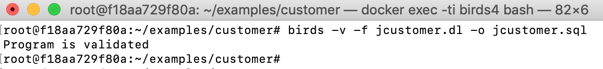
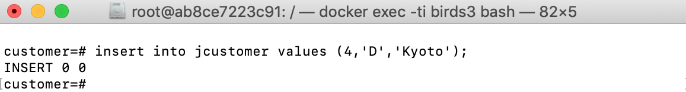
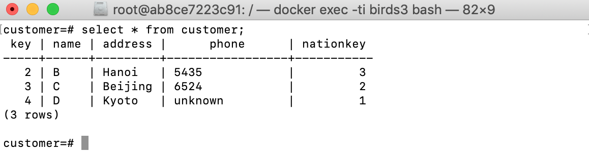
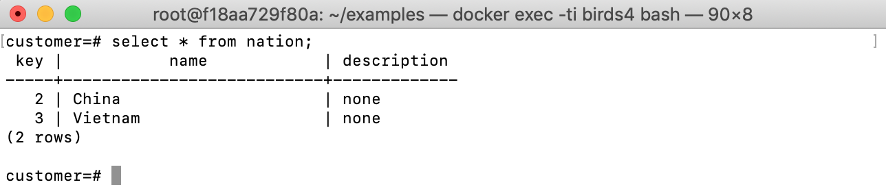
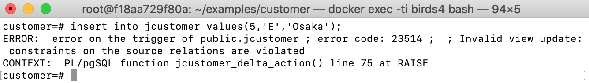

# Example: customers database schema

## Schema

The customers database ([customer.sql]({{site.github.repository_url}}/tree/master/examples/customer/db/customer.sql)) contain two base tables `nation(key, name, description)` and `customer(key, name, address, phone, nationkey)` and a view `jcustomer(key, name, address)`

`nation`

| key |           name            | description |
|-----|---------------------------|-------------|
|   1 | Japan                     | none        |
|   2 | China                     | none        |
|   3 | Vietnam                   | none        |

`customer`

 key | name | address |      phone      | nationkey 
-----|------|---------|-----------------|-----------
   1 | A    | Tokyo   | 2432            |         1
   2 | B    | Hanoi   | 5435            |         3
   3 | C    | Beijing | 6524            |         2

`jcustomer`

 key | name | address 
-----|------|---------
   1 | A    | Tokyo

## Update strategy for `jcustomer`

If thinking forwardly, the view `jcustomer`, which contains all customers having Japanese citizenship, can be defined by a query over the two base tables as the
following in Datalog:

```prolog
jcustomer(K, N, A) :- customer(K, N, A, P, NK), nation(NK, NATION, D),
NATION='Japan'.
```

Which is a join of tables `customer` and `nation` on the attribute
`NATIONKEY` with a condition that the nationality is `Japan`. We keep
only three attributes `KEY`, `NAME` and `ADDRESS` from the table
`customer` in the view.

To illustrate the ambiguity of propagating updates on the view
`jcustomer`, let’s consider a simple request to delete tuple ⟨`1, A, Tokyo`⟩ from the view
`jcustomer`. Obviously, there are three options for propagating this
deletion to the source database. The first option is to delete from the
table `customer` the tuple ⟨`1, A, Tokyo, 1234, 1`⟩. The second is to
delete from the table `nation` the tuple ⟨`1, Japan, none`⟩. The third
is to perform both deletions in the first and the second options.

Backwardly, we can explicitly specify an update strategy on the view `jcustomer` as the following ([jcustomer.dl]({{site.github.repository_url}}/tree/master/examples/customer/jcustomer.dl)):

```prolog
source nation('KEY':int,'NAME':string,'DESCRIPTION':string).
source customer('KEY':int,'NAME':string,'ADDRESS':string,'PHONE':string,'NATIONKEY':int).
view jcustomer('KEY':int,'NAME':string,'ADDRESS':string).

% constraint:
⊥ :- not nation(_, 'Japan', _).

-customer(K, N, A, P, NK) :- customer(K, N, A, P, NK), nation(NK, NATION, _), NATION ='Japan', not jcustomer(K, N, A).

tmp(K, N, A) :- customer(K, N, A, _, NK), nation(NK, 'Japan', _).
+customer(K, N, A, P, NK) :- jcustomer(K, N, A), not tmp(K, N, A), nation(NK, 'Japan', _), customer(K, _, _, P, _).
+customer(K, N, A, P, NK) :- jcustomer(K, N, A), not tmp(K, N, A), nation(NK, 'Japan', _), not customer(K, _, _, _, _), P = 'unknown'.
```

We assume that in the source table `nation` there exists a tuple having
the attribute `NATION` equal to `‘Japan’`:
`∃x, y, nation(x, 'Japan', y)`. We express this
constraint by a special Datalog rule with a truth constant ⊥ in the head `⊥ :- not nation(_, 'Japan', _)`.
The meaning of this rule is a first-order logic sentence
`(¬∃x, y, nation(x, ‘Japan′, y)) → ⊥`,
which is equivalent to `∃x, y, nation(x, ‘Japan′, y)`.
Given an updated view `jcustomer`, our update strategy is to keep the table
`nation` unchanged, and update the table `customer` to reflect the view
updates. First, if there is a Japanese customer, who does not appear in
the view, we choose the option of deleting this customer from the source
table `customer`
that is more reasonable than deleting the tuple
`⟨1, ‘Japan′⟩` from the table `nation`. Second, if there
is a customer in the view `jcustomer` but there is no Japanese customer
in the source tables having the same values for `KEY, NAME, ADDRESS`,
then we insert a new customer to the table `customer` (lines 7, 8 and 9).
More concretely, to fill the attribute `NATIONKEY`, we find a key from
the table `nation` where the nationality is `‘Japan’`. Due to the
constraint on `nation` presented before, we can always find such a key.
To fill in the attribute `PHONE`, we search for the existing one in the
old table `customer`. If it is not found, we fill in the attribute
`PHONE` a default string `‘unknown’`.

## Verifying and compiling the update strategy to SQL:

```bash
birds -v -f jcustomer.dl -o jcustomer.sql
```



The defining query of the view is also automatically derived by the above command.

## Running in PostgreSQL

Let's go to the PostgreSQL database using `psql -U postgres` and try an `INSERT` statement on the view `jcustomer`:

```sql
insert into jcustomer values (4,'D','Kyoto');
```



And check the base table `customer` after the update:


A new tuple `⟨4, D, Kyoto, unknown, 1⟩` was inserted into `customer`.

Let's delete one tuple from `jcustomer`:

```sql
delete from jcustomer where key=1;
```

And the result:



If we insert into `jcustomer` a new tuple having the same key `4`, then there is a key conflict, the insertion will be rejected:


Obviously, the strategy is based on the constraint that there exists a tuple `(_, 'Japan', _)` in the table `nation`. The generated SQL code also checks the existence of such a tuple before doing any view update. Thereby, if we delete the tuple `(1,'Japan','none')` from `nation`:

```sql
delete from nation where name='Japan';
```

That the new table `nation` does not have the nation `Japan` anymore, 



Updates to the view `jcustomer` will be rejected with the error message 'Invalid view update: constraints on the source relations are violated':

