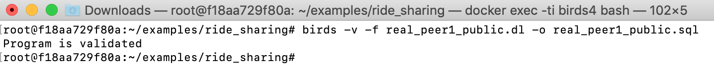

# Examples on a ride-sharing schema

The ride-sharing schema ([schema.sql]({{site.github.repository_url}}/tree/master/examples/ride_sharing/schema.sql)) contains three tables:

`area` 

 original_node | area_node 
---------------|-----------
             0 |         0
            50 |         0
           100 |         1
           200 |         2
           300 |         3
           400 |         4
           500 |         5
           600 |         6
           700 |         7
           800 |         8

`peer1_vehicle`

vehicle_id | current_location | seat_count | request_id | pickup_location | dropoff_location 
------------|------------------|------------|------------|-----------------|------------------
          1 |              200 |          4 |          3 |             200 |              300
          2 |               50 |          4 |            |                 |                 
          3 |              100 |          4 |            |                 |                 
          4 |              300 |          4 |            |                 |                 
          5 |              500 |          4 |            |                 |                 
          6 |              600 |          4 |            |                 |                 
          7 |              400 |          4 |            |                 |                 

`peer2_vehicle`

 vehicle_id | current_location | seat_count | request_id | pickup_location | dropoff_location 
 ------------|------------------|------------|------------|-----------------|------------------
          1 |              600 |          4 |          5 |             600 |              700
          3 |              300 |          4 |            |                 |                 
         10 |              400 |          4 |            |                 |                 
          2 |              800 |          4 |            |                 |                 
         11 |              100 |          4 |            |                 |                 
         12 |               50 |          4 |            |                 |                 
         13 |              700 |          4 |            |                 |                 
         23 |              200 |          4 |            |                 |    

## View `peer1_public`

The following is an update strategy on the view `peer1_public` by using Datalog ([real_peer1_public.dl]({{site.github.repository_url}}/tree/master/examples/ride_sharing/real_peer1_public.dl)):

```prolog
source peer1_vehicle('VEHICLE_ID':int , 'CURRENT_LOCATION':int , 'SEAT_COUNT':int , 'REQUEST_ID':int , 'PICKUP_LOCATION':int , 'DROPOFF_LOCATION':int).
source area('ORIGINAL_NODE':int , 'AREA_NODE':int).
view peer1_public('VEHICLE_ID':int , 'CURRENT_AREA':int , 'SEAT_COUNT':int , 'REQUEST_ID':int , 'PICKUP_LOCATION':int , 'DROPOFF_LOCATION':int).

% view definition
peer1_public(V, A, S, R, P, D) :- peer1_vehicle (V, L, S, R, P, D), area (L,A).

%constraints
% primary key VEHICLE_ID on peer1_vehicle
_|_ :- peer1_vehicle (V, L1, S1, R1, P1, D1), peer1_vehicle (V, L2, S2, R2, P2, D2), NOT L1 = L2.
_|_ :- peer1_vehicle (V, L1, S1, R1, P1, D1), peer1_vehicle (V, L2, S2, R2, P2, D2), NOT S1 = S2.
_|_ :- peer1_vehicle (V, L1, S1, R1, P1, D1), peer1_vehicle (V, L2, S2, R2, P2, D2), NOT R1 = R2.
_|_ :- peer1_vehicle (V, L1, S1, R1, P1, D1), peer1_vehicle (V, L2, S2, R2, P2, D2), NOT P1 = P2.
_|_ :- peer1_vehicle (V, L1, S1, R1, P1, D1), peer1_vehicle (V, L2, S2, R2, P2, D2), NOT D1 = D2.

% primary key ORIGINAL_NODE
_|_ :- area (ORIGINAL_NODE, AREA_NODE1),  area (ORIGINAL_NODE, AREA_NODE2), NOT AREA_NODE1 = AREA_NODE2.

% primary key VEHICLE_ID on peer1_public
_|_ :- peer1_public (V, L1, S1, R1, P1, D1), peer1_public (V, L2, S2, R2, P2, D2), NOT L1 = L2.
_|_ :- peer1_public (V, L1, S1, R1, P1, D1), peer1_public (V, L2, S2, R2, P2, D2), NOT S1 = S2.
_|_ :- peer1_public (V, L1, S1, R1, P1, D1), peer1_public (V, L2, S2, R2, P2, D2), NOT R1 = R2.
_|_ :- peer1_public (V, L1, S1, R1, P1, D1), peer1_public (V, L2, S2, R2, P2, D2), NOT P1 = P2.
_|_ :- peer1_public (V, L1, S1, R1, P1, D1), peer1_public (V, L2, S2, R2, P2, D2), NOT D1 = D2.

% prevent update on the column CURRENT_AREA
_|_ :-peer1_vehicle (V, L, S, R, P, D), area (L,A1), peer1_public (V, A2, _, _, _, _), NOT A1 = A2.
% prevent insertion or deletion of a new vehicle id
all_id(V) :- peer1_vehicle (V, L, _, _, _, _), area (L,_).
_|_ :- all_id(V), NOT peer1_public (V, _, _, _, _, _).
_|_ :-peer1_public (V, _, _, _, _, _), NOT all_id(V).

% update strategy
-peer1_vehicle (V, L, S, R, P, D) :- peer1_vehicle (V, L, S, R, P, D), area (L,A), not peer1_public(V, A, S, R, P, D).
+peer1_vehicle (V, L, S, R, P, D) :- peer1_public (V, A, S, R, P, D), peer1_vehicle (V,L,_, _, _, _), area (L,A), not peer1_vehicle(V, L, S, R, P, D).
```

Verifying and compiling the update strategy to SQL statements saved in the file ([real_peer1_public.sql]({{site.github.repository_url}}/tree/master/examples/ride_sharing/real_peer1_public.sql)):
   
```bash
birds -v -f real_peer1_public.dl -o real_peer1_public.sql
```



## View `peer2_public`

The following is an update strategy on the view `peer2_public` by using Datalog ([real_peer2_public.dl]({{site.github.repository_url}}/tree/master/examples/ride_sharing/real_peer2_public.dl)):

```prolog
source peer2_vehicle('VEHICLE_ID':int , 'CURRENT_LOCATION':int , 'SEAT_COUNT':int , 'REQUEST_ID':int , 'PICKUP_LOCATION':int , 'DROPOFF_LOCATION':int).
source area('ORIGINAL_NODE':int , 'AREA_NODE':int).
view peer2_public('VEHICLE_ID':int , 'CURRENT_AREA':int , 'SEAT_COUNT':int , 'REQUEST_ID':int , 'PICKUP_LOCATION':int , 'DROPOFF_LOCATION':int).

% view definition
peer2_public(V, A, S, R, P, D) :- peer2_vehicle (V, L, S, R, P, D), area (L,A).

%constraints
% primary key VEHICLE_ID on peer2_vehicle
_|_ :- peer2_vehicle (V, L1, S1, R1, P1, D1), peer2_vehicle (V, L2, S2, R2, P2, D2), NOT L1 = L2.
_|_ :- peer2_vehicle (V, L1, S1, R1, P1, D1), peer2_vehicle (V, L2, S2, R2, P2, D2), NOT S1 = S2.
_|_ :- peer2_vehicle (V, L1, S1, R1, P1, D1), peer2_vehicle (V, L2, S2, R2, P2, D2), NOT R1 = R2.
_|_ :- peer2_vehicle (V, L1, S1, R1, P1, D1), peer2_vehicle (V, L2, S2, R2, P2, D2), NOT P1 = P2.
_|_ :- peer2_vehicle (V, L1, S1, R1, P1, D1), peer2_vehicle (V, L2, S2, R2, P2, D2), NOT D1 = D2.

% primary key ORIGINAL_NODE
_|_ :- area (ORIGINAL_NODE, AREA_NODE1),  area (ORIGINAL_NODE, AREA_NODE2), NOT AREA_NODE1 = AREA_NODE2.

% primary key VEHICLE_ID on peer2_public
_|_ :- peer2_public (V, L1, S1, R1, P1, D1), peer2_public (V, L2, S2, R2, P2, D2), NOT L1 = L2.
_|_ :- peer2_public (V, L1, S1, R1, P1, D1), peer2_public (V, L2, S2, R2, P2, D2), NOT S1 = S2.
_|_ :- peer2_public (V, L1, S1, R1, P1, D1), peer2_public (V, L2, S2, R2, P2, D2), NOT R1 = R2.
_|_ :- peer2_public (V, L1, S1, R1, P1, D1), peer2_public (V, L2, S2, R2, P2, D2), NOT P1 = P2.
_|_ :- peer2_public (V, L1, S1, R1, P1, D1), peer2_public (V, L2, S2, R2, P2, D2), NOT D1 = D2.

% prevent updates on the column CURRENT_AREA
_|_ :-peer2_vehicle (V, L, S, R, P, D), area (L,A1), peer2_public (V, A2, _, _, _, _), NOT A1 = A2.
% prevent insertion or deletion of a new vehicle id
all_id(V) :- peer2_vehicle (V, L, _, _, _, _), area (L,_).
_|_ :- all_id(V), NOT peer2_public (V, _, _, _, _, _).
_|_ :-peer2_public (V, _, _, _, _, _), NOT all_id(V).

% update strategy
-peer2_vehicle (V, L, S, R, P, D) :- peer2_vehicle (V, L, S, R, P, D), area (L,A), not peer2_public(V, A, S, R, P, D).
+peer2_vehicle (V, L, S, R, P, D) :- peer2_public (V, A, S, R, P, D), peer2_vehicle (V,L,_, _, _, _), area (L,A), not peer2_vehicle(V, L, S, R, P, D).
```

Verifying and compiling the update strategy to SQL statements saved in the file ([real_peer2_public.sql]({{site.github.repository_url}}/tree/master/examples/ride_sharing/real_peer2_public.sql)):
   
```bash
birds -v -f real_peer2_public.dl -o real_peer2_public.sql
```


## View `all_vehicles`

Since `peer1_public` and `peer2_public` are both updatable, we can use them as the base relations for other views.

The following is an update strategy for the view `all_vehicles` over `peer1_public` and `peer2_public` by using Datalog ([real_all_vehicles.dl]({{site.github.repository_url}}/tree/master/examples/ride_sharing/real_all_vehicles.dl)):

```prolog
source peer1_public('VEHICLE_ID':int , 'CURRENT_AREA':int , 'SEAT_COUNT':int , 'REQUEST_ID':int , 'PICKUP_LOCATION':int , 'DROPOFF_LOCATION':int).
source peer2_public('VEHICLE_ID':int , 'CURRENT_AREA':int , 'SEAT_COUNT':int , 'REQUEST_ID':int , 'PICKUP_LOCATION':int , 'DROPOFF_LOCATION':int).
view all_vehicles('COMPANY_ID':int, 'VEHICLE_ID':int , 'CURRENT_AREA':int , 'SEAT_COUNT':int , 'REQUEST_ID':int , 'PICKUP_LOCATION':int , 'DROPOFF_LOCATION':int).

% constraint
% ensure that the company_id in all_vehicles is 1 or 2
_|_ :- all_vehicles(C, V, A, S, R, P, D), NOT C=1, NOT C=2.

+peer1_public(V, A, S, R, P, D) :- all_vehicles(C, V, A, S, R, P, D),C = 1, NOT peer1_public(V, A, S, R, P, D).
-peer1_public(V, A, S, R, P, D) :- peer1_public(V, A, S, R, P, D), C = 1, NOT all_vehicles(C, V, A, S, R, P, D).
+peer2_public(V, A, S, R, P, D) :- all_vehicles(C, V, A, S, R, P, D), C = 2, NOT peer2_public(V, A, S, R, P, D).
-peer2_public(V, A, S, R, P, D) :- peer2_public(V, A, S, R, P, D), C = 2, NOT all_vehicles(C, V, A, S, R, P, D).
```

Verifying and compiling the update strategy to SQL statements saved in the file ([real_all_vehicles.sql]({{site.github.repository_url}}/tree/master/examples/ride_sharing/real_all_vehicles.sql)):
    
```bash
birds -v -f real_all_vehicles.dl -o real_all_vehicles.sql
```


