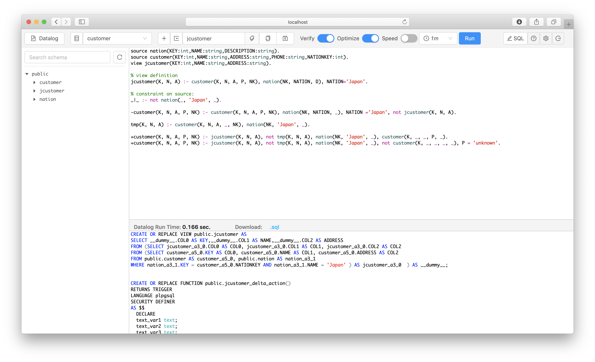

# BIRDS Web-based Datalog editor

The Web-based User Interface is for writing and compiling the Datalog program of view update strategy into SQL code. By connecting to a database, the SQL code can be also executed in the database.

[BIRDS's docker image](https://hub.docker.com/r/dangtv/birds) runs the WebUI on port 3010:

The web app is built based on [SQLPad](https://github.com/rickbergfalk/sqlpad).